# Curating the GNET Insights Dataset

## Introduction

The [GNET Insights Dataset](https://github.com/vortexegg/gnet-insights-dataset) is a collection of insight blog posts published by the The Global Network on Extremism and Technology on the [GNET Research blog](https://gnet-research.org). The purpose of this dataset is to provide researchers with a source of data for conducting information studies such as textual  analysis on the publication practices and topical trends within the intersecting fields of technology and terrorism & violent extremism.

The GNET Insights dataset was collected by [Scott Johnson](https://github.com/vortexegg) by scraping insight posts from the [GNET Research blog](https://gnet-research.org). The original GNET insight articles are solicited, commissioned, edited, and published by The Global Network on Extremism and Technology (GNET), led by the [International Centre for the Study of Radicalisation](https://icsr.info) (ICSR) at the Department of War Studies at King’s College London and backed by the [Global Internet Forum to Counter Terrorism](https://gifct.org) (GIFCT). The contents of each insight post are the original work of the attributed authors.

The purpose of this project is to create a rich dataset of texts, authorship, and publication information that can be used to better understand trends in the research published by GNET. The field of terrorism studies, and particularly the intersection of the study of terrorism and technology platforms, is in need of ongoing library and information studies to assess trends within this research domain. GNET is a rapid research blog that produces topical research on the technology and terrorism landscape from a diverse range of global authors, and is thus ripe for text mining and other data analysis to gain this understanding.

## Dataset

The data and related code for the GNET Insights dataset can be found on the [gnet-insights-dataset](https://github.com/vortexegg/gnet-insights-dataset) GitHub repository. The dataset itself is compiled in a [CSV file](https://github.com/vortexegg/gnet-insights-dataset/blob/main/gnet_insights.csv). The dataset can be accessed by either cloning the repository, or simply downloading the raw CSV file.

### Data dictionary

The GNET insights dataset includes the following fields:

| field name     | data type         | description                                                                                                                                                                                                          |
| -------------- | ----------------- | -------------------------------------------------------------------------------------------------------------------------------------------------------------------------------------------------------------------- |
| `insight_url`  | text              | The original URL of the insight post on [gnet-research.org](https://gnet-research.org). Serves as a canonical identifier for the post.                                                                               |
| `title`        | text              | The title of the insight post.                                                                                                                                                                                       |
| `author_names` | list-value (text) | A list of one or more names of the authors who contributed to writing the insight post.                                                                                                                              |
| `author_urls`  | list-value (text) | A list of one or more URLs to an author page on [gnet-research.org](https://gnet-research.org) showing other insights written by the same author. Should correspond 1:1 with `author_names`.                         |
| `pub_date`     | date              | The publication date of the insight, in `YYYY-MM-DD` format.                                                                                                                                                         |
| `categories`   | list-value (text) | A list of one or more post categories under which the insight is classified on [gnet-research.org](https://gnet-research.org). With few exceptions, this is typically just the category "Insights".                  |
| `insight_text` | text              | The full text of the insight post in plain text format, stripped of the original HTML formatting. Hyperlinks in the original post text have been removed, leaving only the text contained within the anchor element. |
| `insight_urls` | list-value (text) | A list of zero or more URLs that were cited as hyperlinks in the body of the original post text.                                                                                                                     |
| `tags`         | list-value (text) | A list of zero or more descriptive tags that were applied to the insight post.                                                                                                                                       |

All list-value fields are constructed using the following syntax: `"['value one', 'value two',...]"`

### Data cleaning

Due to the formatting of the list-value fields, data cleaning may be necessary to process these fields before they can be used in data analysis.

In particular, for use in the R programming language, it is recommended to convert list-value fields into R vectors, by stripping the enclosing brackets and single-quotes and splitting the string into a vector. This is useful for converting the data into a [tidy data format](https://tidyr.tidyverse.org/articles/tidy-data.html) for use with [tidyverse](https://www.tidyverse.org) R packages, which stipulates: "3. Each value is a cell; each cell is a single value." Vectorized list-value fields can be converted into a tidy data format by using the [tidyr](https://tidyr.tidyverse.org) package's `unnest_longer` function.

For Python, the list-value fields are already stored in a format compatible for deserialization using the Python pickle module.

### Collection

This dataset was collected by scraping the [GNET Research blog](https://gnet-research.org) using a Python script written with the [BeautifulSoup](https://www.crummy.com/software/BeautifulSoup/) web scraping library. The scraping script is located at [gnet_insight_scraper.ipynb](https://github.com/vortexegg/gnet-insights-dataset/blob/main/gnet_insight_scraper.ipynb). The significant choices made in scraping this dataset include:

1. Only including insight posts (GNET publishes other kinds of resources including full-length reports, research digests, etc.).
2. Extracting specific metadata about each insight post from the scrapped web page, which form the metadata elements listed in the data dictionary (see above).

## Usage

The main use case envisioned for the GNET Insights Dataset is for various communities to conduct topic and publication trend analysis of public research at the intersection of technology and terrorism & violent extremism.

This dataset may be of primary use to GNET itself, as the publisher and editor of the GNET Research blog, and for GNET's funders, GIFCT. These organizations can use the dataset to assess and adjust ongoing trends in publication of insights, make changes in editorial decisions and solicitation of posts, and join this dataset together with other data such as web page view analytics to gain a better understanding of readership interests. A second important set of users are extremism studies researchers (who make up the primary authorship of the blog) as well as practitioners such as trust & safety professionals who are working on applying these insights to inform their day-to-day work. This dataset could help them keep abreast of important and emerging trends, and to both adjust their plans for what topics to write about or for what under-covered research topics should be requested through GIFCT. Finally, the general readership of GNET, which includes tech company and government policy-makers as well as civil society, would also benefit from seeing summary trends and having the ability to visualize and orient themselves within the overall topical landscape of technology and terrorism & violent extremism.

While GNET insights are written in-part for a general audience, and this dataset can be utilized for gaining a general topical orientation, any users of this dataset will be well-served by possessing general knowledge and grounding in the study of terrorism and violent extremism. In particular, it is recommended to approach this data from a critical terrorism studies lens that understands the critical questions of power and ethics behind the essentially contested concepts and definitions of "terrorism" and "extremism", which are necessarily embroiled in political questions about the construction of power and the deligitimation of violence. Before engaging with this data it is crucial to understand that analyzing topics related to these subjects involves exposure to hateful narratives and depictions of racially and ethnically motivated violence. Researchers should take appropriate psychological safety precautions before and during the course of engaging with this challenging subject matter.

## Findings/Results/Summary

### Introduction

The following computational analysis is meant to give an overview of major patterns within the GNET insights dataset, and to provide examples of how text analysis might be used to understand topical trends in GNET insights. The analyses performed cover overall statistics about insight publishing and publication dates, authorship and author publication trends, insight tags and tag trends, as well as a demonstration of using text analysis for evaluating frequently used keywords and bigrams, and an illustrative example of comparing frequently occurring bigrams across specific tags.

The R script used to conduct the computational analysis can be [found here](https://github.com/vortexegg/gnet-insights-dataset/blob/main/analyze_gnet.R).

### 1. Overall insight stats and publication dates 

The dataset contains a total of 615 insight posts. These posts cover a range of publication dates from December 31st, 2019 to May 5th, 2024. This end date is the date when the dataset was last updated by scraping the GNET Research website.

***Summary statistics: Insights published per year***

| Max | Median | Mean  | Min |
| --- | ------ | ----- | --- |
| 152 | 130    | 102.5 | 7   |

The discrepancy between the median and min number of insights per year is due to there only being seven insights published in 2019, all on December 31st (2024 also has fewer than average insights but this year is still ongoing).

***Summary statistics: Insights published per month***

| Max | Median | Mean | Min |
| --- | ------ | ---- | --- |
| 21  | 12     | 11   | 3   |

Trends in the number of insights published each month is best represented through a visualization. As can be seen, there is a wide variability in the rate of publication from month-to-month, with extend periods of high and low rates of publication.

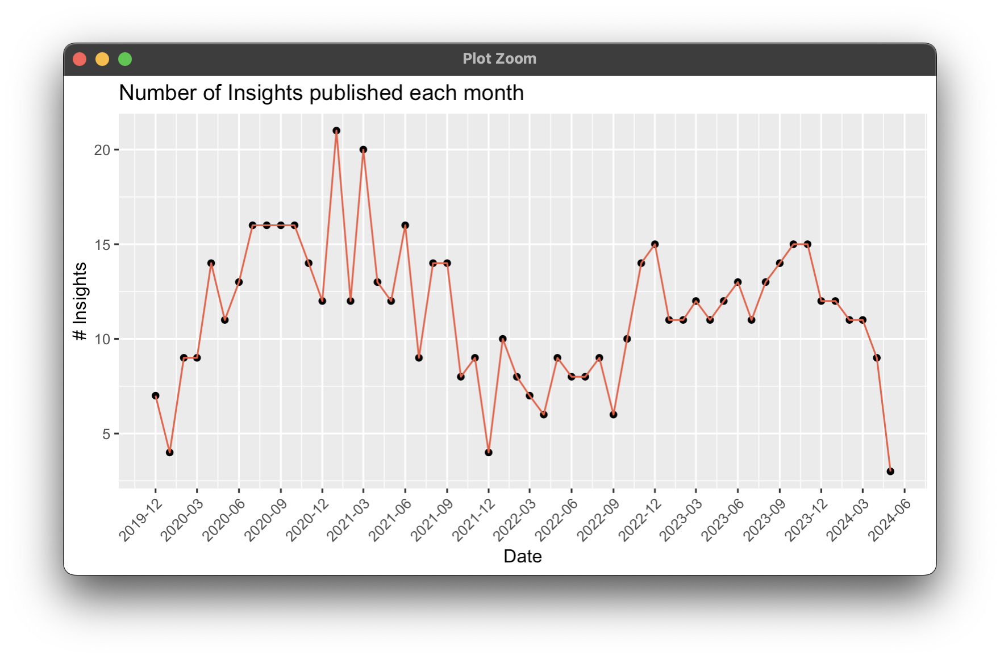
*Fig. 1: Insights published each month*

### 2. Authors and author publication trends

The dataset contains insights that have been published by 453 different authors.

***Summary statistics: Contributions by multiple authors per insight***

| Max | Median | Mean | Min |
| --- | ------ | ---- | --- |
| 6   | 1      | 1    | 1   |

While some insights have multiple authors who all contributed to writing the insight, on average insights are typically written by a single author.

***Summary statistics: Multiple insights per author***

| Max | Median | Mean | Min |
| --- | ------ | ---- | --- |
| 21  | 1      | 2    | 1   |

Conversely, several authors have written or contributed to more than one insight. We see that the max number of insights for a single author is twenty-one, while the average is between 1-2 insights. The discrepancy between these stats implies that there is a long tail of single-insight contributors. Visualizing this distribution, we can see that the majority of authors have contributed only a single insight, several more authors have contributed between two to five insights, and a small number of authors have contributed six or more insights.

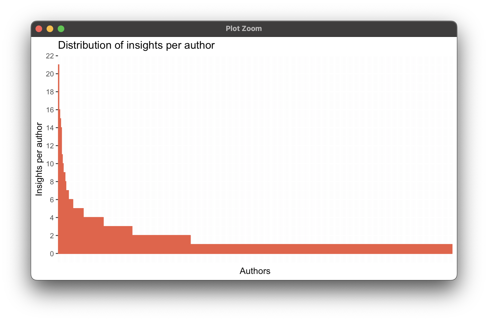
*Fig. 2: Distribution of insights per author*

There are seventeen authors who have contributed to six or more insights. Here we can see the top contributing authors and the number of insights per author:

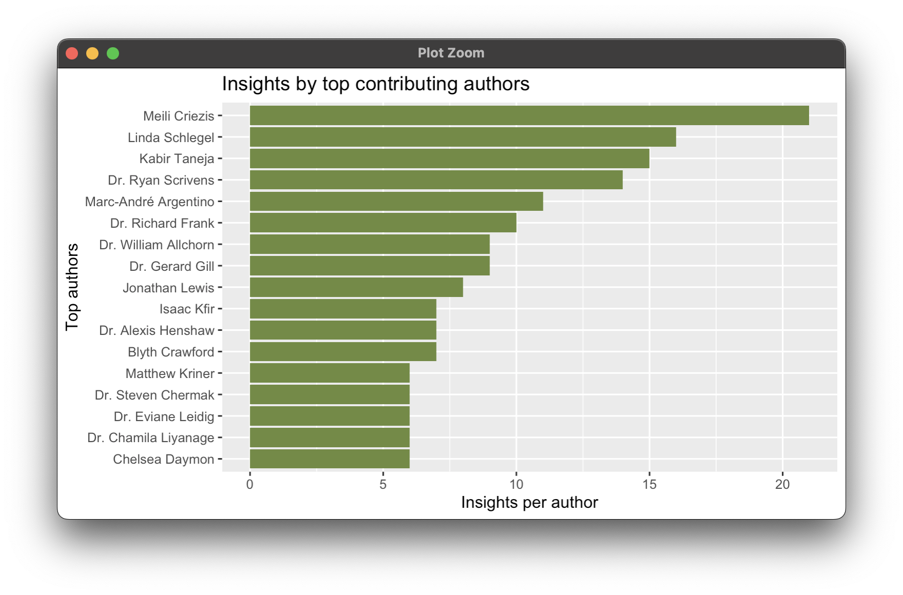
*Fig. 3: Insights by top contributing authors*

For the top ten authors, we can visualize trends in how they have contributed insights over GNET's publication timespan. Of interest, we can see that the top contributing authors have all had runs of consistent publications that each drop off after a certain point. Notably most top authors have dropped off from writing sometime in 2023, while two top authors have continued consistently publishing in to 2024 (these also happen to be the two top contributors of all time).

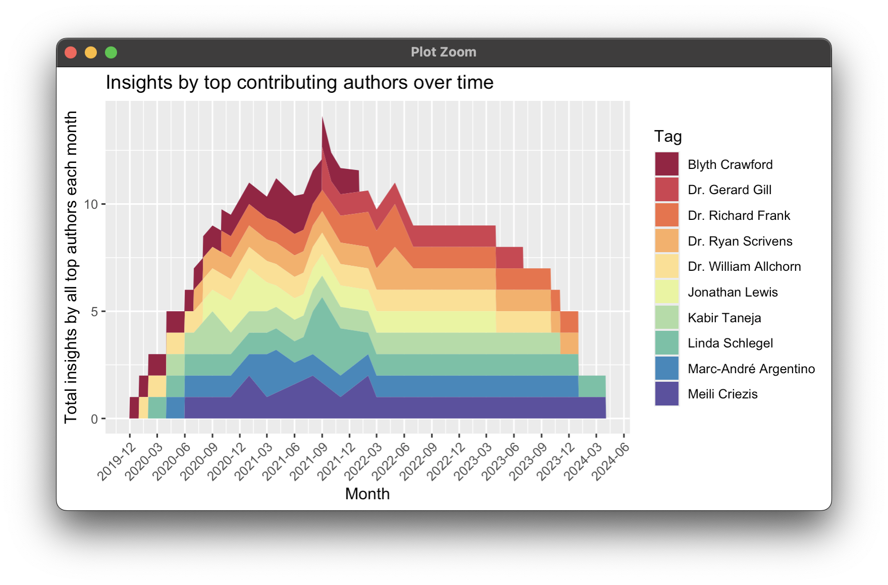
*Fig. 4: Insights by top contributing authors over time*

### 3. Insight tags and tag trends

The dataset contains insights that have been applied with a mix of 87 different tags.

***Summary statistics: Insights per tag***

| Max | Median | Mean | Min |
| --- | ------ | ---- | --- |
| 197 | 10     | 18   | 2   |

As with authors, there is a wide discrepancy between the max and median number of tags, implying a long tail of insights with only a small number of tags. Visualizing the distribution of insights per tag, we can see that most tags have been applied to approximately twenty or fewer insights. A small number of tags have been applied to anywhere between twenty-one to several hundred insights.

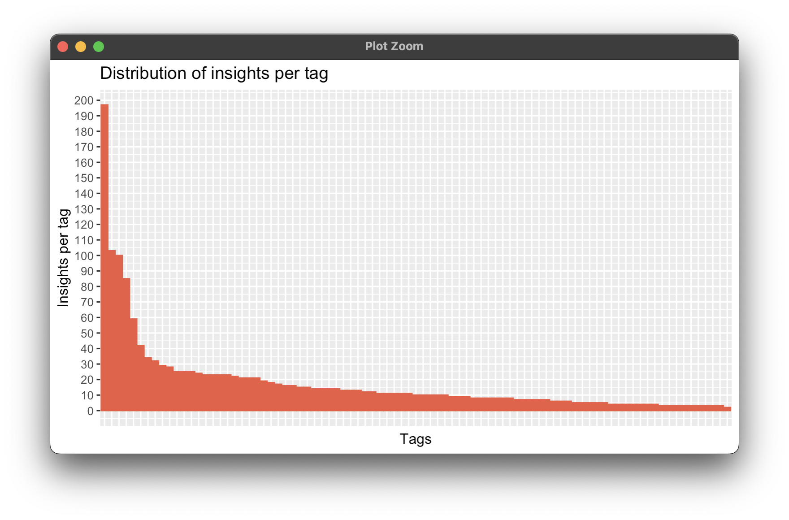
*Fig. 5: Distribution of insights per tag*

There are twenty-two tags that have been applied to twenty-one or more insights. Here we can see the top tags and the number of insights they have been applied to. The most frequently applied tags are "Far-Right", "Social Media", "Islamic State", "Propaganda", and "Radicalisation". This combination of tags lends a key insight into the nature of the problem of digital extremism as it is carried out on social media platforms (or at least, what GNET insight authors choose to publish about it).

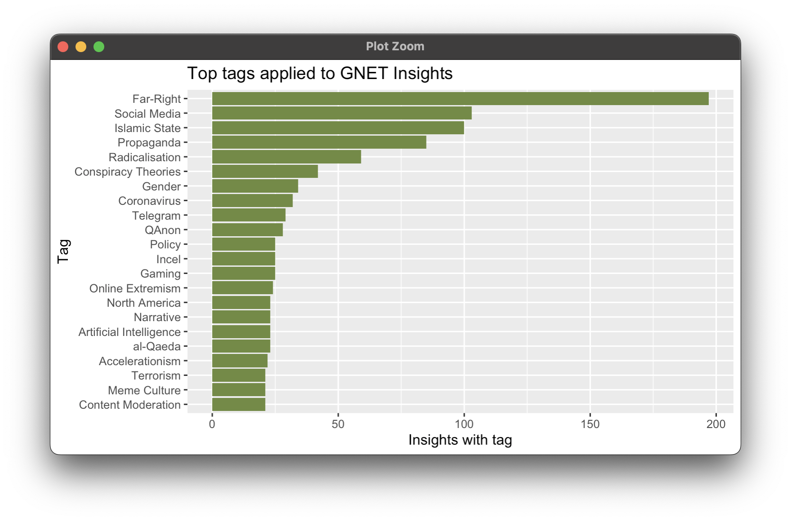
*Fig. 6: Top tags applied to GNET insights*

For the top ten tags, we can visualize trends in how these tags have been applied to insights over GNET's publication timespan. There are a few interesting patterns revealed by this plot. From 2019 to 2021 there was a larger relative focus on insights tagged with "Social Media" and "Islamic State". This changes substantially in early 2021, leading to an increasing focus on "Far-Right" insights and, eventually, insights about "Gender"-related issues of extremism. Then in early 2024 there is another shift. Tags that were consistently used from 2021 entirely fall off, including "Gender", "Telegram", and "QAnon", while the "Far-Right" tag drastically shrinks while "Islamic State" comes back into prominence.

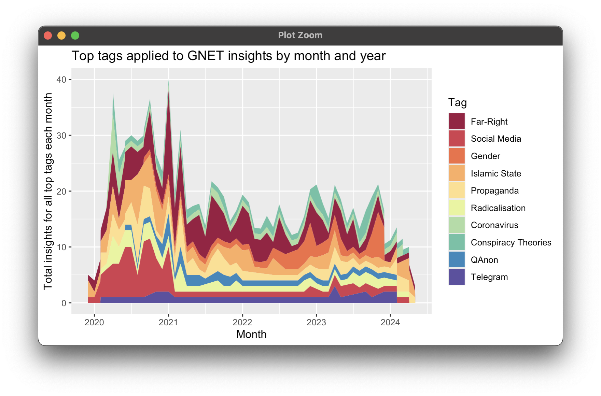
*Fig. 7: Top tags applied to GNET insights by month and year*

### 4. Demonstration of text analysis for topical trends

Apart from summary statistics, this section demonstrates the value of one of the key uses of the GNET Insights Dataset—the application of text analysis techniques to insight post texts to understand trends in topics, mentioned keywords, etc. This demonstration only scratches the surface of what is possible, by visualizing the most frequently used words and bigrams in the text corpus, as well as trends in how the most frequently used bigrams have changed over time.

Here we see a plot of the top most used words in the GNET insight texts, and their frequency of use:

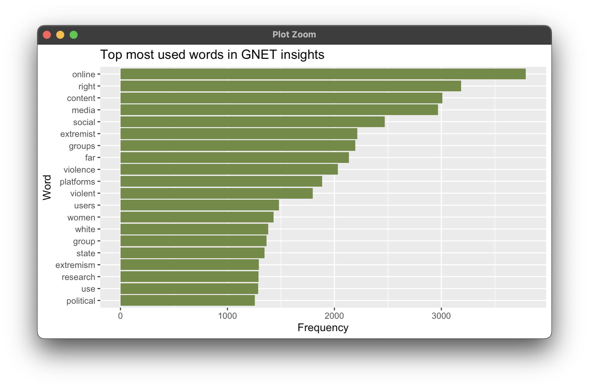
*Fig. 10: Top most used words in GNET insights*

While this is interesting, visualizing the top most used bigrams is much more revealing of the general topics discussed throughout the GNET insight texts. The two most used bigrams, "far right" and "social media", followed by "islamic state" and "right wing", are indeed reflective of the overall GNET Research blog and also align with the most commonly used tags. But we also see other important concepts that contextualize topics at the intersection of technology and terrorism, such as "covid 19" (a major driver of extremist conspiracy narratives), or "tech companies" and "content moderation" (a primary site for responding to the harms of online extremism).

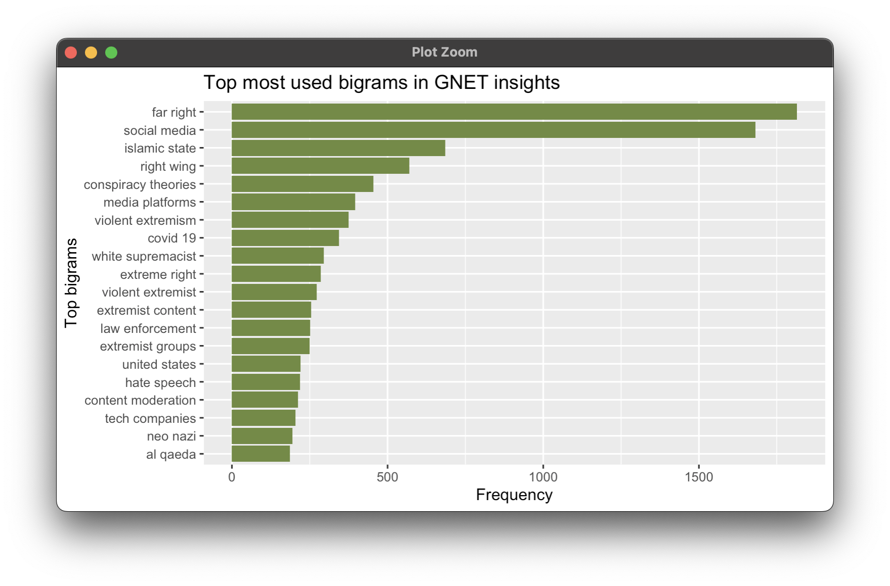
*Fig. 11: Top most used bigrams in GNET insights*

Visualizing changes in the most frequent bigrams year-over-year also reveals interesting changes in the research landscape. For example, in 2019, a frequently used bigram is "iron march", referring to a now-defunct Neo-Nazi web forum (and thus less topically relevant today). On the other hand, at the bottom of 2024 we see the bigram "gaming spaces", which reflects an emerging focus in the collective response to online extremism focusing on the exploitation of gaming platforms by extremist actors.

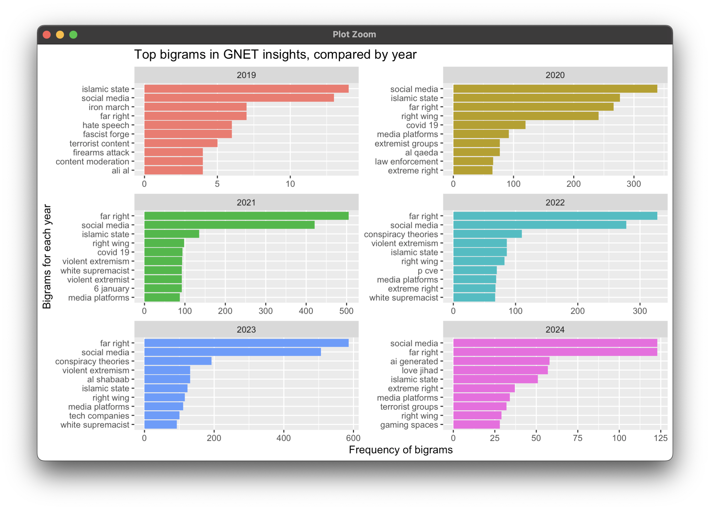
*Fig. 12: Top bigrams in GNET insights, compared by year*

### 5. Example of frequent bigrams across group or ideology tags

To provide a further example, we can compare the most frequently used bigrams across specific tags. In particular, the top tags include several tags related to various extremist or terrorist groups or ideologies: Far-Right, Islamic State, Incel, and QAnon. Here we visualize the most frequently used bigrams within the set of insights tagged with each of these four movements, to give a comparison of how they are discussed. Of note, both Far-Right and QAnon tagged insights make frequent discussion of conspiracy theories, though the Far-Right tag focuses on white supremacism and neo-nazis, while QAnon focuses instead on the "deep state" and Donald Trump. In contrast, the Islamic State tag discusses various jihadist groups and IS supporters, while the Incel tag discusses issues of male supremacism, online forums, and mass violence.

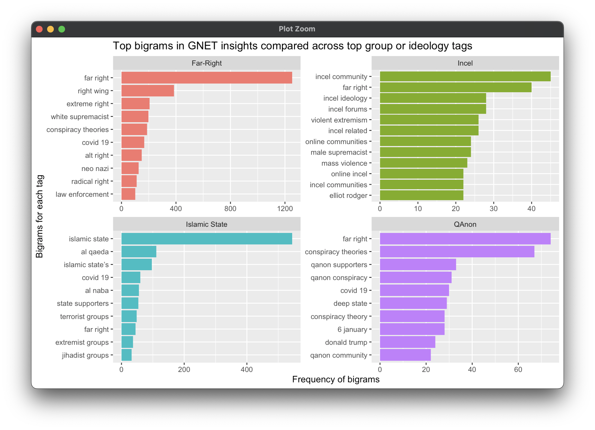
*Fig. 13: Top bigrams in GET insights across group or ideology tags*

It is also illustrative to compare these frequent bigrams to example titles of insight articles associated with each tag. Here we can see the most recent four articles from each tag, which gives further color into the nature of these topics.

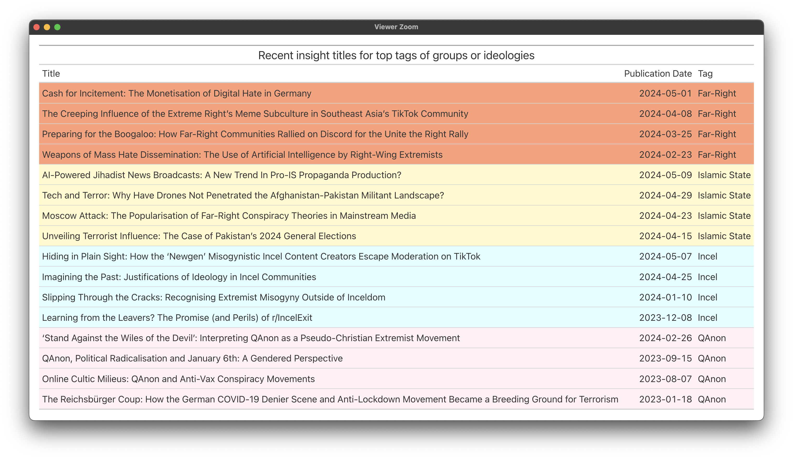
*Fig. 14: Recent insight titles for top groups or ideology tags*

## Ethical concerns and limitations

*You discuss possible ethical considerations or concerns with your project, as well as limitations that the reader should keep in mind*

- Appropriate and ethical representation and accuracy
- Need to establish data licensing and reuse
- Epistemic limitations

*Given that terrorism is a contested category, care will need to be taken to ensure that the research subjects studied within the GNET research insights, and analyzed as topics in the dataset, are presented in an appropriate ethical lens. Similarly, a broader use of this dataset will require engagement with the GNET organization in order to establish appropriate data licensing and reuse considerations*.

*A key question frequently asked about data and studies of the intersection of technology and terrorism is, "What can this tell us about the prevalence of the problem of terrorism on various digital platforms?" It is critical to note that there is epistemic limitation of the GNET Insights Dataset in that it cannot be used as evidence of the scope of the actual landscape of digital extremism and use of technology by terrorists. Rather, this dataset is evidence of the research practices and subject topics that are being reported on by extremism studies researchers, who have chosen to write about specific topics specifically at the nexus of technology and terrorism. Data analyses regarding, for example, the counts of references to specific extremist groups mentioned in the dataset are not indicative of the prevalence or degree of harms of those specific groups online or offline. Likewise, counts of references to specific technologies or tech platforms are not indicative of the scope of the use of those platforms by terrorists, etc. Rather, such analyses would only demonstrate that these groups or tech platforms happen to be frequently written about by GNET researchers (and which frequency may or may not correlate to the degree of real world harms).*

*Based on the above points about critical terrorism studies and the epistemic limits of a dataset that is secondary research of academic studies, users of this dataset should apply care in making claims about the underlying terrorist and extremist subjects represented by the GNET insights which are contained in the dataset. It is noted that the GNET Insights Dataset is not an open-source terrorism database nor is it a collection of secondary data about terrorist and extremist subjects, but is rather a set of high-level research reports or summaries produced by extremism researchers in a non-peer-reviewed academic blog. Furthermore, users of this dataset should take care in how they communicate information about the terrorist and violent extremist groups and individuals represented in the GNET insight blog posts, in particular related to privacy and human rights concerns regarding human subjects.*

## Future Work

*You address a possible direction for future work. If you had more time and resources, where would you go next with this project?*

**What additional types of data or analyses**

- Different types of text analysis; named entity recognition, topic analysis
- Analysis of URLs in text, and the pages they point to
- Analysis of references to specific geographic areas, groups, ideologies, technologies, etc based on named entity recognition
- Combine dataset with demographic and geographic data about authors, and various other entities and topics

**Other future work**

- Data permissions and republication
- Automated process for keeping dataset up to date

*One key challenge that may need to be addressed in order for this dataset to be used more broadly relates to data permissions and re-publication. Despite the GNET website and blog posts being publicly available, I have not obtained explicit permission to scrape and download the full blog data, analyze, or publish on it. GNET does not have any statements about data reuse or licensing on their website that would clarify what is implicitly permitted. Similarly, I have not obtained permission or consent from the individual authors. It is unclear to me whether this type of permission and consent is necessary to obtain as part of conducting bibliometric research on published works. Assuming the permission challenge can be resolved, second related challenge involves identifying a suitable way to host the data in an accessible location online (e.g. in a GitHub repository?) and establishing a sustainable process for extracting new blog posts to add to the dataset as they are published.*

*I think both of these challenge are within the realm of possibility to be solved through my existing personal and professional relationships within the terrorism studies community and with staff at GNET itself. The first problem could be addressed through discussing with GNET and GIFCT about establishing an agreement for this dataset to be curated and hosted going forward, and if necessary establishing appropriate data licensing and reuse documentation. The second problem of creating a sustainable process for collecting data could potentially be addressed through a technical data sharing project with GNET that involves them sending requisite metadata fields and article text to the dataset owner (or potentially adding the data themselves if the dataset is hosted in an open-source repository).*