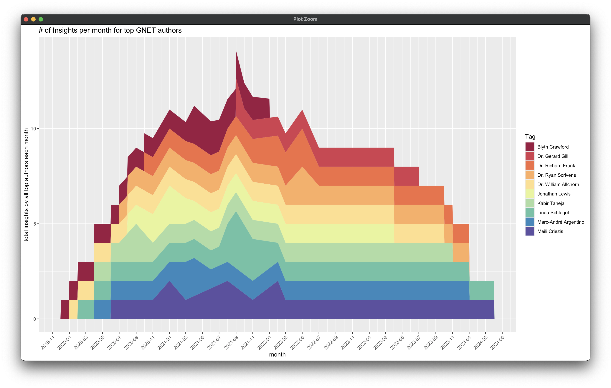
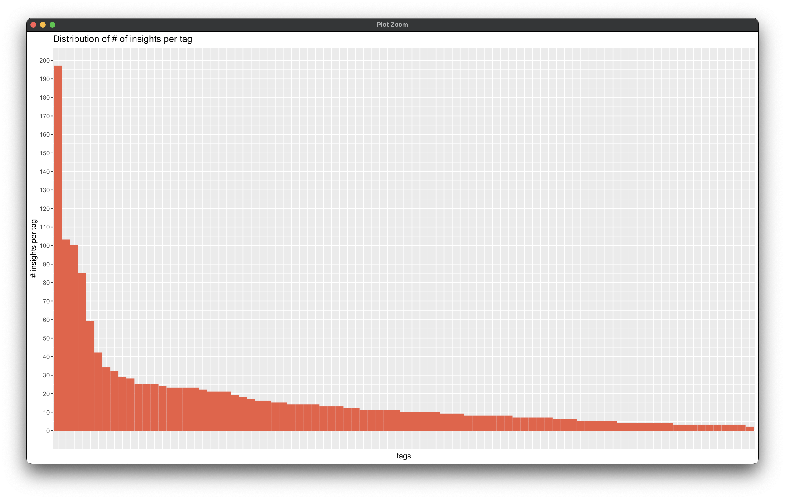
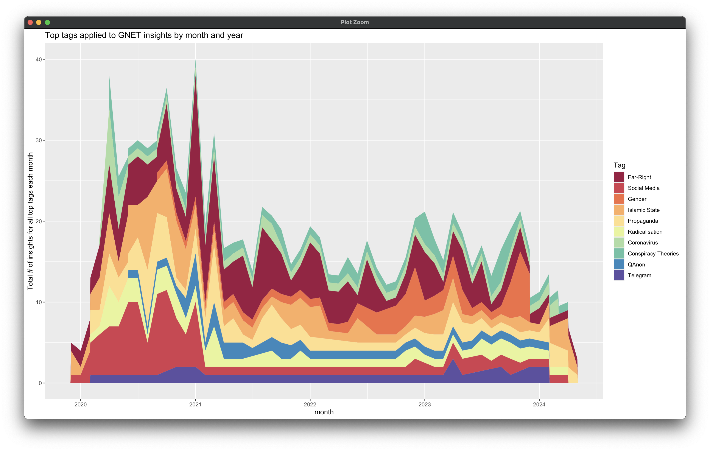
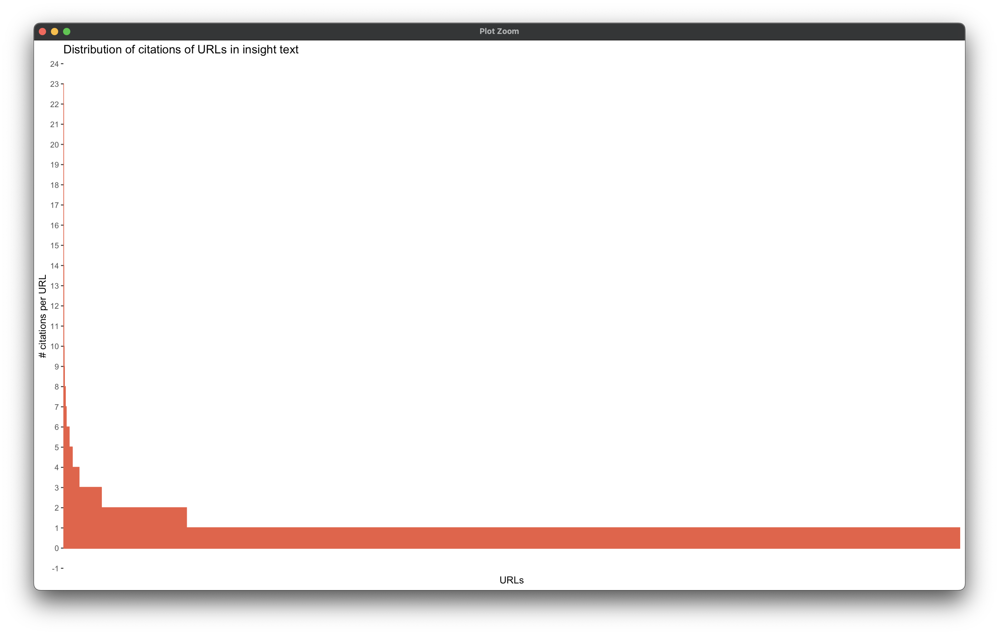
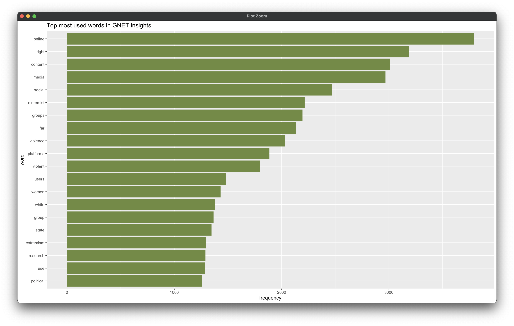
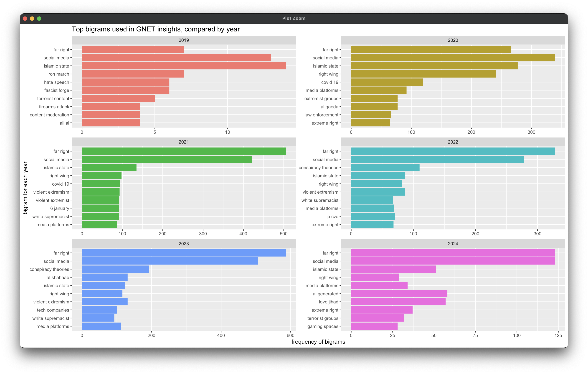
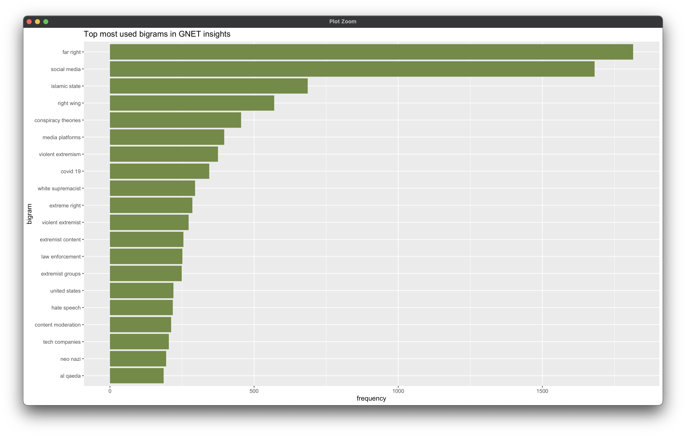

# Curating the GNET Insights Dataset

## Introduction

The GNET Insights Dataset is a collection of post text and related metadata from 'insights' published on the The Global Network on Extremism and Technology's [GNET Research blog](https://gnet-research.org). The purpose of this dataset is to provide researchers with a source of data for conducting information studies such as textual and bibliometric data analysis about publication practices and topical trends within the intersecting fields of technology studies and terrorism & violent extremism.

The GNET Insights dataset was collected by Scott Johnson based on scraping insight posts from the [GNET Research blog](https://gnet-research.org). The original GNET insight articles are solicited, commissioned, edited, and published by The Global Network on Extremism and Technology (GNET), led by the [International Centre for the Study of Radicalisation](https://icsr.info) (ICSR) at the Department of War Studies at King’s College London and backed by the [Global Internet Forum to Counter Terrorism](https://gifct.org) (GIFCT). The contents of each insight post are the original work of the attributed authors.

The purpose of **Curating the GNET Insights Dataset** is to create a rich dataset of texts, authorship, and publication information that can be used to better understand trends in the research published by GNET. The field of terrorism studies, and particularly the intersection of the study of terrorism and technology platforms, is in need of ongoing library and information studies to assess trends within this research domain. GNET is a rapid research blog that produces topical research on the technology and terrorism landscape from a diverse range of global authors, and is thus ripe for text mining and other data analysis to gain this understanding.

## Dataset

*You introduce the dataset that you either analyzed or created, and you include relevant details from your dataset biography, such that the reader can engage and evaluate your project thoroughly and thoughtfully*

**Overall description of dataset**

The data and related code for the GNET Insights data set can be found on GitHub at the [gnet-insights-dataset](https://github.com/vortexegg/gnet-insights-dataset) repository. The dataset is itself is compiled in a CSV file [gnet_insights.csv](https://github.com/vortexegg/gnet-insights-dataset/blob/main/gnet_insights.csv). The dataset can be accessed by either cloning the repository, or simply downloading the raw CSV file.

The dataset was collected by scraping the [GNET Research blog](https://gnet-research.org) using a Python script written with the [BeautifulSoup](https://www.crummy.com/software/BeautifulSoup/) web scraping library. You can find the website scraping script at [gnet_insight_scraper.ipynb](https://github.com/vortexegg/gnet-insights-dataset/blob/main/gnet_insight_scraper.ipynb). The significant choices made in scraping this dataset included:

1. Only including insight posts (GNET also publishes other kinds of resources including full-length reports, research digests, and podcast episodes)
2. Extracting specific metadata about each Insight post from the scrapped web page, including the Insight URL, title, authors, author URLs, publication date, post category, full article text, hyperlinks included in the article text, and post tags.

As mentioned above, the original GNET insights were solicited and published by GNET, and the categories and tags associated with each insight article were applied by GNET at time of original publication.

Basic data documentation, data dictionary

Collection

## Ethical concerns and limitations

*You discuss possible ethical considerations or concerns with your project, as well as limitations that the reader should keep in mind*

Given that terrorism is a contested category, care will need to be taken to ensure that the research subjects studied within the GNET research insights, and analyzed as topics in the dataset, are presented in an appropriate ethical lens. Similarly, a broader use of this dataset will require engagement with the GNET organization in order to establish appropriate data licensing and reuse considerations.

A key question frequently asked about data and studies of the intersection of technology and terrorism is, "What can this tell us about the prevalence of the problem of terrorism on various digital platforms?" It is critical to note that there is epistemic limitation of the GNET Insights Dataset in that it cannot be used as evidence of the scope of the actual landscape of digital extremism and use of technology by terrorists. Rather, this dataset is evidence of the research practices and subject topics that are being reported on by extremism studies researchers, who have chosen to write about specific topics specifically at the nexus of technology and terrorism. Data analyses regarding, for example, the counts of references to specific extremist groups mentioned in the dataset are not indicative of the prevalence or degree of harms of those specific groups online or offline. Likewise, counts of references to specific technologies or tech platforms are not indicative of the scope of the use of those platforms by terrorists, etc. Rather, such analyses would only demonstrate that these groups or tech platforms happen to be frequently written about by GNET researchers (and which frequency may or may not correlate to the degree of real world harms).

Based on the above points about critical terrorism studies and the epistemic limits of a dataset that is secondary research of academic studies, users of this dataset should apply care in making claims about the underlying terrorist and extremist subjects represented by the GNET insights which are contained in the dataset. It is noted that the GNET Insights Dataset is not an open-source terrorism database nor is it a collection of secondary data about terrorist and extremist subjects, but is rather a set of high-level research reports or summaries produced by extremism researchers in a non-peer-reviewed academic blog. Furthermore, users of this dataset should take care in how they communicate information about the terrorist and violent extremist groups and individuals represented in the GNET insight blog posts, in particular related to privacy and human rights concerns regarding human subjects.

## Findings/Results/Summary

*present a summary of the data's basic characteristics

*You include 3 data viz/plots, and you sufficiently introduce and describe them in the blog post. You point out any salient details or overall patterns that the reader/viewer should pay attention to and understand*

- Data cleaning of list values, currently stored as pickled python lists exported to CSV, need to `unnest_longer` to analyze multi-value nested list columns

- Insights published per month

- Authors
	- Count authors
	- Distribution of insights per author
	- Top contributing authors
	- Top authors insights over the years
	- Distinct insight authors per year

- Tags
	- Count tags
	- Distribution of insights per tag
	- Count of insights for the top tags
	- Count of top tags over the years

- URLs cited in insights
	- Min, Max, Average number of URLs in insights
	- Distribution of insights per URL
	- Top domains cited in insights

- Text analysis
	- top words
	- top bigrams and trend in top bigrams per year
	- top tf_idf of bigrams and trend in tfidf per year

****
*You zoom in and discuss a specific example or data point from your dataset to illustrate a point or support your findings/results (a specific movie, book, song, NBA player, etc.)*

**Focus on one specific insight?**
**???**

*discuss why the data might be useful and who it might be useful for*

Background knowledge

While GNET insights are written partially for consumption by the general public, in order to make responsible use of the GNET Insights Dataset it is helpful to have a grounding in the study of terrorism and violent extremism and related topics. Furthermore, collections of data about terrorism, and data about the study of terrorism, should be approached from a critical terrorism studies lens that appreciates that definitions of terrorism and who counts as as a terrorist or extremist group or ideology are 'essentially contested' and embroiled in political questions about the construction of power and the deligitimation of violence. Finally, users of this dataset should be aware that the study of terrorist and extremist subjects can be psychologically and morally challenging to researchers. Analyzing these subjects necessarily involves exposure to hateful narratives and imagery and descriptions or depictions of violence that are associated with racially and ideologically motivated extremist subjects. It is critical to have grounding in appropriate handling of these topics in order to mitigate personal harm and protect researcher safety.

The GNET Insights Dataset and any topical trend analysis of this data can provide potential value for a number of audiences. First and foremost the Global Network on Extremism and Technology, as the publisher and editor of the GNET Research blog, and the Global Internet Forum to Counter Terrorism, as the primary funding body of GNET, would both benefit from being better able to assess the impact of the research insights and make more data-driven decisions about solicitation of various authors and topics for future research (including making sure that diverse and relevant topics are discussed and a diverse authorship is represented). This data set can also be joined with a number of other datasets such as website pageview analytics and other data about authors like their global and institutional locations, which would give a more holistic understanding of the value and impact of the blog.

The second set of beneficiaries of this dataset are terrorism studies researchers themselves. By seeing trends in what topics are being written about, this can help researchers better understand if there are either any topics they are overlooking in their own research, or alternatively if there is a saturation of other researchers already publishing about a particular topic (e.g. the impact of generative AI on extremist propaganda) the researchers can focus on a different area.

Finally, the general readership of the blog, including tech company and government policy decision-makers, would also benefit in seeing a summary of topical and authorship trends just as much as they benefit from the actual research insights themselves. One of the primary goals of GNET is to keep these decision-makers abreast of such tends, so being able to visualize trends at the topical and entity level would provide that much more insight.

## Future Work

*You address a possible direction for future work. If you had more time and resources, where would you go next with this project?*

**What additional types of data or analyses**

- Demographic and geographic data about authors
- Named entity recognition text analysis
- Analysis of geographic areas, groups, ideologies, technologies discussed

One key challenge that may need to be addressed in order for this dataset to be used more broadly relates to data permissions and re-publication. Despite the GNET website and blog posts being publicly available, I have not obtained explicit permission to scrape and download the full blog data, analyze, or publish on it. GNET does not have any statements about data reuse or licensing on their website that would clarify what is implicitly permitted. Similarly, I have not obtained permission or consent from the individual authors. It is unclear to me whether this type of permission and consent is necessary to obtain as part of conducting bibliometric research on published works. Assuming the permission challenge can be resolved, second related challenge involves identifying a suitable way to host the data in an accessible location online (e.g. in a GitHub repository?) and establishing a sustainable process for extracting new blog posts to add to the dataset as they are published.

I think both of these challenge are within the realm of possibility to be solved through my existing personal and professional relationships within the terrorism studies community and with staff at GNET itself. The first problem could be addressed through discussing with GNET and GIFCT about establishing an agreement for this dataset to be curated and hosted going forward, and if necessary establishing appropriate data licensing and reuse documentation. The second problem of creating a sustainable process for collecting data could potentially be addressed through a technical data sharing project with GNET that involves them sending requisite metadata fields and article text to the dataset owner (or potentially adding the data themselves if the dataset is hosted in an open-source repository).

# Cut content

Test content

Solarized dark             |  Solarized Ocean
:-------------------------:|:-------------------------:
  |  

*GNET was funded by GIFCT as an academic research initiative at the intersection of technology and counterterrorism/countering violent extremism. GIFCT leads a cross-sectoral, multistakeholder collaboration to marshal the collective creativity of society to tackle issues related to online extremism and exploitation of digital platforms by terrorists. GNET pulls together topical research from new and established researchers in the extremism studies field in the form of rapid brief insights that are primarily targeted at informing trust & safety professionals and policy-makers at tech companies, governments, and civil society, as well as for other extremism studies researchers and the general public. The GNET Insights Dataset project was conceived as a means of providing researchers with a dataset for conducting information science and bibliometric research about the research topics that are published within this niche intersection of technology and counterterrorism.*

*Besides constructing and curating this dataset, this project aims to engage in presenting summary statistics about authorship and blog tag usage over time, as well as to engage in text mining techniques to identify trends in topics and named entities that occur within the research insights. This dataset and accompanying topical analysis will prove useful both to the publishers and funders of the GNET research blog, as well as the broader community of terrorism studies researchers and the general audience of the blog.*